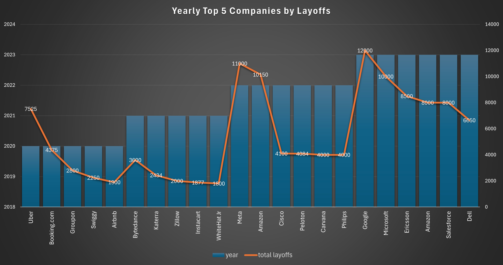

# SQL_Data_Cleaning_and_EDA_Project
## Introduction
This project focuses on analyzing a global layoffs dataset using SQL. The dataset provides information about layoffs across industries, countries, company stages, and time periods. The aim was to clean the raw data, explore it with structured queries, and extract meaningful insights into global employment trends, particularly in the tech and startup ecosystem.
## Project Overview
This project performs data cleaning and exploratory data analysis (EDA) on a global layoffs dataset using SQL.
The goal is to uncover insights about how layoffs have varied across industries, countries, company stages, and over time.
By writing optimized SQL queries, this project identifies trends such as:
- Which companies had the largest layoffs
- Which industries and countries were most affected
- Yearly and monthly layoff patterns
- Relation between company funding and layoffs
- Stages of startups most impacted
## Dataset
The dataset used in this project contains layoff records across different industries and countries.

**Key columns include:**
- **Company** → Name of the company
- **Industry** → Industry sector
- **Country** → Country where layoffs occurred
- **Total_Laid_Off** → Number of employees laid off
- **Percentage_Laid_Off** → Share of workforce laid off (0–1)
- **Funds_Raised_Millions** → Total funding raised by the company (in millions)
- **Date** → Date of layoff
## Technologies Used
- **SQL** (MySQL) → Used for data cleaning and exploratory data analysis (EDA).
- **Excel** → Utilized for generating charts and visualizations to present analytical findings.
- **ChatGPT** → Supported the project by refining insights, documentation, and interpretations for faster workflow.
## Data Cleaning Steps
The raw dataset contained missing values, duplicates, and formatting inconsistencies. Cleaning steps included:
- Removing duplicate rows
- Handling missing/null values in key fields (industry, country, stage)
- Converting date into proper date format
- Standardizing categorical values (e.g., merging similar industry names)
## Exploratory Data Analysis (EDA)
During EDA, the dataset was examined to ensure quality and to extract meaningful insights. Key steps included detecting outliers, identifying trends in layoffs across industries and stages, and calculating normalized measures such as layoffs per million dollars raised. This process provided a deeper understanding of workforce reduction patterns and served as the foundation for the visual analysis and final interpretations.
### 1. Top 10 Companies with the highest total layoffs
```sql 
SELECT 
    company, SUM(total_laid_off)
FROM
    layoffs_staging2
GROUP BY company
ORDER BY SUM(total_laid_off) DESC
LIMIT 10;
```
- **Amazon** recorded the highest layoffs (18,150), significantly higher than other companies.
- **Tech giants** (Amazon, Google, Meta, Microsoft, Salesforce) dominate the top of the list, reflecting widespread restructuring in the technology sector.
- **Philips and Ericsson** highlight that layoffs were not limited to software/IT but also impacted hardware and telecommunications.

| Company     | Total Laid Off |
| ----------- | -------------- |
| Amazon      | 18,150         |
| Google      | 12,000         |
| Meta        | 11,000         |
| Salesforce  | 10,090         |
| Microsoft   | 10,000         |
| Philips     | 10,000         |
| Ericsson    | 8,500          |
| Uber        | 7,585          |
| Dell        | 6,650          |
| Booking.com | 4,601          |

*Top_Companies_Layoffs*
### 2. Companies with the highest total funds raised (in millions)
```sql 
SELECT 
    company, SUM(funds_raised_millions)
FROM
    layoffs_staging2
GROUP BY company
ORDER BY SUM(funds_raised_millions) DESC;
```
- **Extreme Outlier:** Netflix dominates the dataset with $487.6B raised, nearly 4x more than Uber ($123.5B), making it a clear outlier in global funding.
- **Sector Hotspots:** The majority of mega-funding is concentrated in mobility (Uber, Lyft, Ola, Gojek, Grab), social media/entertainment (Twitter, Bytedance, Snap, TikTok India), fintech (Robinhood, Klarna, Stripe, Paytm), and e-commerce/logistics (Delivery Hero, Swiggy, Gopuff, DoorDash).
- **Geographic Diversity:** Indian startups (Byju’s, OYO, Swiggy, Unacademy, Meesho) raised billions, showing India’s growing role in the global funding landscape, rivaling US-based giants.
- **Funding Anomalies:** Companies like WeWork ($65.7B) and Magic Leap ($2.6B) attracted massive funding despite struggling with scalability and execution, highlighting investor misjudgments.
- **Power-Law Distribution:** Only a handful of companies raised above $50B, while most fall between $2–10B, showing that capital is heavily concentrated among a few firms.

| Company       | Funds Raised (in Millions) |
| ------------- | -------------------------- |
| Netflix       | 487,600                    |
| Uber          | 123,500                    |
| WeWork        | 65,700                     |
| Twitter       | 38,700                     |
| Bytedance     | 35,600                     |
| Delivery Hero | 26,500                     |
| Meta          | 26,000                     |
| Rivian        | 24,500                     |
| Tesla         | 20,200                     |
| Ola           | 18,800                     |

*Showing some Companies with the Highest Capital Raised*
### 3. Industries ranked by layoffs per million dollars raised
```sql 
SELECT 
    industry,
    SUM(total_laid_off) AS total_layoffs,
    SUM(funds_raised_millions) AS total_funds,
    ROUND((SUM(total_laid_off)) / NULLIF(SUM(funds_raised_millions), 0),
            2) AS layoffs_per_million
FROM
    layoffs_staging2
WHERE
    total_laid_off IS NOT NULL
        AND funds_raised_millions IS NOT NULL
GROUP BY industry
ORDER BY layoffs_per_million DESC;
```
- Sales, Recruiting, and Infrastructure industries show the highest layoffs per million dollars raised (1.73, 1.45, 1.23), indicating capital inefficiency and       workforce instability.
- Retail, Crypto, and Education also report relatively high layoff ratios, suggesting industries with heavy workforce reliance are vulnerable despite large          funding.
- On the opposite end, Media is a major outlier — with nearly $498B raised but only ~4.5K layoffs, resulting in just 0.01 layoffs per million, showing extreme       capital absorption with minimal workforce impact.
- Transportation ($251B raised, 32.9K layoffs) and Consumer ($141B, 44K layoffs) reflect high investment but comparatively lower layoffs per million, suggesting     better workforce retention per funding unit.
- The data reveals a power-law effect: industries with smaller funding pools (like Sales, Recruiting) show disproportionately higher layoff ratios, while heavily    capitalized industries (Media, Transportation) manage layoffs more efficiently.


| Industry        | Total Layoffs | Total Funds (in Millions) | Layoffs per Million |
|-----------------|---------------|----------------------------|----------------------|
| Sales           | 13,216        | 7,649                      | 1.73                 |
| Recruiting      | 2,478         | 1,706                      | 1.45                 |
| Infrastructure  | 5,573         | 4,539                      | 1.23                 |
| Other           | 34,740        | 28,677                     | 1.21                 |
| Fitness         | 8,698         | 10,056                     | 0.86                 |
| Retail          | 42,342        | 58,021                     | 0.73                 |
| Construction    | 3,863         | 5,379                      | 0.72                 |
| Crypto          | 9,611         | 14,303                     | 0.67                 |
| Education       | 13,125        | 23,980                     | 0.55                 |
| Support         | 2,823         | 5,321                      | 0.53                 |

*Top 10 Industries by Layoffs per Million Raised*
### 4. Yearly layoffs trend
```sql
SELECT 
    YEAR(`date`), SUM(total_laid_off)
FROM
    layoffs_staging2
GROUP BY YEAR(`date`)
ORDER BY SUM(total_laid_off) DESC;
```
- 2022 was the peak year with 160,661 layoffs, the highest in the dataset and nearly double the combined total of 2020 and 2021.
- 2021 saw the lowest layoffs (15,823), suggesting a temporary recovery period before the massive spike in 2022.
- Layoffs in 2023 (125,677) remained significantly high, though 22% lower than 2022, indicating some stabilization.
- The pandemic year 2020 (80,998 layoffs) had a strong initial impact, but the real surge came later in 2022, pointing to delayed effects on the job market.


| Year | Total Laid Off |
|------|----------------|
| 2020 | 80,998         |
| 2021 | 15,823         |
| 2022 | 160,661        |
| 2023 | 125,677        |

*Total Layoffs by Year*
### 5. Top 5 companies per year with the highest layoffs
```sql
with Company_Year (company, years, total_laid_off) as
(
select company, year(`date`), sum(total_laid_off)
from layoffs_staging2
group by company, year(`date`)
), Company_Year_Rank as
(
select *, 
dense_rank() over (partition by years order by total_laid_off DESC) as Ranking
from Company_Year
where years is not null
)
select * from Company_Year_Rank
where Ranking <= 5;
```
- 2020 layoffs were led by Uber (7,525) and Booking.com (4,375), reflecting the immediate pandemic hit on travel and mobility sectors.
- In 2021, layoffs were much smaller in scale, with Bytedance (3,600) topping the list — showing a relatively quiet layoff year compared to others.
- 2022 saw a major escalation, led by Meta (11,000) and Amazon (10,150), as the tech sector entered a large-scale downsizing phase.
- 2023 marked the peak for big tech, with Google (12,000) and Microsoft (10,000) leading — highlighting how even industry giants were not immune.
- Amazon appears twice (2022 & 2023) in the top rankings, signaling consistent large-scale restructuring over multiple years.



*This graph represents top 5 Companies with the Largest Layoffs by Year*
### 6. Layoffs by Company Stage: Number of Companies, total layoffs, and Average layoffs per Company
```sql
SELECT 
    stage,
    COUNT(DISTINCT company) AS num_companies,
    SUM(COALESCE(total_laid_off, 0)) AS total_layoffs,
    ROUND(SUM(COALESCE(total_laid_off, 0)) / NULLIF(COUNT(DISTINCT company), 0),
            2) AS avg_layoffs_per_company
FROM
    layoffs_staging2
WHERE
    stage IS NOT NULL
GROUP BY stage
ORDER BY avg_layoffs_per_company DESC;
```
- Post-IPO companies dominate layoffs with 204,132 employees laid off across 286 firms, averaging 713 per company. This reflects how public companies scale big      and downsize big.
- Late-stage startups (Series H, I, J) show very high layoffs per company (500–1,190 average), suggesting funding maturity comes with larger teams and bigger        risks of mass layoffs.
- Early-stage startups (Seed, Series A, B) have much smaller layoffs, averaging 32–64 employees, consistent with their smaller workforce sizes.
- Acquired companies also had significant layoffs (27,576 total), showing that mergers often lead to redundancies.
- Overall, the data shows a direct correlation between funding maturity and layoff severity — the further along the funding stage, the higher the average layoffs.


| Stage         | No. of Companies | Total Laid Off | Avg. Laid Off per Company |
|---------------|------------------|----------------|---------------------------|
| Series J      | 3                | 3,570          | 1,190.00                  |
| Post-IPO      | 286              | 204,132        | 713.75                    |
| Series H      | 12               | 7,244          | 603.67                    |
| Series I      | 5                | 2,855          | 571.00                    |
| Series G      | 11               | 3,697          | 336.09                    |
| Private Equity| 30               | 7,957          | 265.23                    |
| Acquired      | 121              | 27,576         | 227.90                    |
| Series F      | 44               | 9,932          | 225.73                    |
| Subsidiary    | 5                | 1,094          | 218.80                    |
| Unknown       | 279              | 40,716         | 145.94                    |
| Series E      | 89               | 12,697         | 142.66                    |
| Series D      | 167              | 19,225         | 115.12                    |
| Series C      | 217              | 20,017         | 92.24                     |
| Series B      | 238              | 15,311         | 64.33                     |
| Series A      | 135              | 5,678          | 42.06                     |
| Seed          | 51               | 1,636          | 32.08                     |

*Impact of Company Stage on Layoffs*
 
## Key Insights
- **Consumer** (45k) and **Retail** (43k) industries had the highest layoffs.
- **Transportation** (33k) and **Finance** (28k) were also heavily impacted.
- Some companies laid off **100%** of their workforce, showing complete shutdowns.
- **US-based companies** contributed the majority of layoffs globally.
- Startup stages like **Series B** and **IPO** showed the largest layoffs, as bigger firms cut costs.
- 2020–2022 saw major spikes in layoffs, likely due to **COVID-19** and post-pandemic restructuring.
- Normalized metric **(layoffs per million raised)** revealed **crypto** and **transportation** sectors were disproportionately affected.
## What I Learned
Through this project, I learned how to:
- Clean messy datasets directly in SQL (handling nulls, duplicates, inconsistent text).
- Write aggregate queries with GROUP BY, ORDER BY, and window functions.
- Use CTEs and subqueries to simplify complex analysis.
- Perform time-series analysis (monthly/yearly trends, rolling sums) in SQL.
- Derive business insights from raw numbers instead of just looking at totals.

This strengthened my SQL skills and gave me practical experience in data storytelling through queries.
## Conclusion
This project showed how SQL alone can be a powerful tool for data analysis, not just for storage and retrieval.
By analyzing layoffs data, I uncovered industry-wide and time-based patterns that reflect real-world economic and business challenges.

**The project demonstrates the importance of:**
- Data cleaning before analysis (garbage in = garbage out).
- Using both absolute metrics (total layoffs) and normalized metrics (layoffs per million funding).
- Looking at data from multiple perspectives — company-level, industry-level, and time-based.
## Closing Thoughts
This was a valuable exercise in end-to-end SQL project work — from cleaning data, writing queries, to interpreting results.
It highlights the potential of SQL not just as a database language but as a data exploration and insight generation tool.
